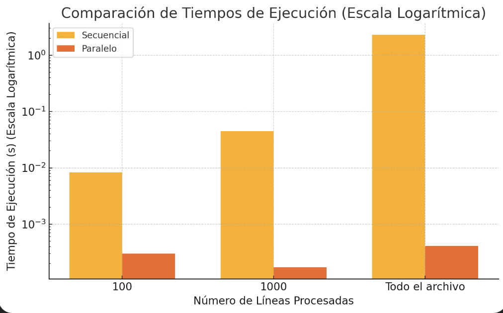
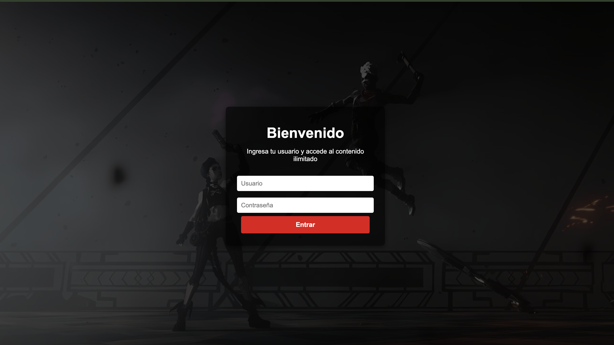
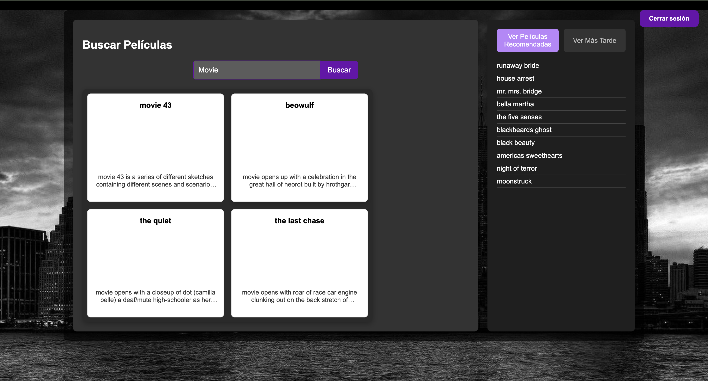

# Programación III: Proyecto Final (2024-2)

## Integrantes
* Nombre y Apellidos
* Nombre y Apellidos
* Nombre y Apellidos
* Nombre y Apellidos

---

## Plataforma de Streaming
Este proyecto implementa una plataforma de **streaming** que permite la administración de la **búsqueda y visualización** de películas. Entre sus principales funcionalidades destacan:

- **Búsquedas rápidas y eficientes** por palabras clave, frases o prefijos en títulos, sinopsis y etiquetas.
- **Sistema de recomendaciones** personalizadas basado en las preferencias del usuario.
- **Gestión de usuarios**, incluyendo listas de "Me gusta" y "Ver más tarde".
- Interfaz gráfica intuitiva y visualmente atractiva.

---

## Descripción de los Archivos del Backend

### `src/server.cpp`
Este archivo configura el servidor HTTP utilizando la biblioteca `httplib`. Define los endpoints principales y maneja el ciclo de vida del servidor. Entre sus principales endpoints están:
- **/login**: Para iniciar sesión.
- **/register**: Para registrar usuarios.
- **/search**: Para realizar búsquedas.
- **/recommendations**: Para obtener recomendaciones personalizadas.

### `src/endpoints.cpp`
Define la lógica detrás de cada endpoint, detallando las operaciones a realizar:
- **handleLogin**: Verifica las credenciales del usuario.
- **handleSearchMovies**: Realiza la búsqueda en la base de datos utilizando un Trie.
- **handleGetRecommendations**: Genera recomendaciones basadas en las preferencias del usuario.
- **handleLikeMovie** y **handleWatchLaterMovie**: Gestionan las acciones del usuario sobre las películas.

### `src/movie_database.cpp`
Administra la carga y organización de datos. Implementa la estructura de Árbol Trie para:
- Búsquedas rápidas por título, sinopsis y etiquetas.
- Soporte para búsquedas por relevancia.

### `src/recommendation_system.cpp`
Implementa el sistema de recomendaciones. Utiliza algoritmos personalizados que consideran:
- Películas marcadas como "Me gusta".
- Historial de búsqueda.
- Listas de "Ver más tarde".

### `src/trie.cpp`
Define la estructura de datos Trie, optimizada para:
- Búsquedas eficientes por prefijo.
- Organización jerárquica de datos.
- Cálculo de relevancia basado en el término de búsqueda.

### `src/user.cpp`
Gestiona las operaciones relacionadas con el usuario:
- Manejo de listas de "Me gusta" y "Ver más tarde".
- Historial de búsquedas.
- Notificaciones de cambios mediante el patrón Observer.

---

## Comparación de Tiempos (Secuencial vs Paralelo)

El proyecto utiliza programación paralela para optimizar la carga y procesamiento de datos. Los siguientes resultados demuestran la eficiencia del enfoque paralelo:

| Líneas Procesadas | Secuencial (s) | Paralelo (s) | Aceleración |
|-------------------|----------------|--------------|-------------|
| 100               | 0.00830804     | 0.00030075   | 27.63x      |
| 1000              | 0.044709       | 0.00017225   | 259.57x     |
| Todo el archivo   | 2.2922         | 0.000411583  | 5566.45x    |

### Gráficos de Comparación
#### Comparación de Tiempos

---

## Interfaz Gráfica

### Vista de Inicio de Sesión

### Vista de Búsqueda y Recomendaciones

---

## Patrones de Diseño Implementados

### Singleton
- **MovieDatabase**: Garantiza una única instancia para la gestión de datos de películas.
- **User**: Maneja la sesión del usuario.

### Factory
- **RecommendationFactory**: Crea instancias del sistema de recomendaciones.

### Observer
- Notifica cambios en las preferencias del usuario, como listas de "Me gusta".

### Strategy
- Facilita la implementación de múltiples algoritmos para búsquedas y recomendaciones.

---

## Cómo Ejecutar

### Backend
1. Navega a la carpeta raíz del proyecto.
2. En este caso tenemos creado el directorio build, pero en caso no lo tuvieramos se necesitaria hacer:
3. mkdir build (omite este paso)
4. cd build
4. cmake ..
5. make
6. ./bin/ProyectoProgra3

### Frontend
1. Navega a la carpeta `frontend/`.
2. Instala las dependencias con `npm install`.
3. Inicia el servidor con `npm start`.

### Prueba del Proyecto
1. Accede a [http://localhost:3000](http://localhost:3000).
2. Inicia sesión con un usuario registrado.
3. Explora las funcionalidades de búsqueda y recomendaciones personalizadas.

---

## Conclusión
Este proyecto integra eficientemente **estructuras de datos avanzadas**, como Tries, y **patrones de diseño**, como Singleton y Factory, para ofrecer una experiencia robusta y escalable. La optimización mediante programación paralela asegura un desempeño eficiente incluso con grandes volúmenes de datos. La interfaz intuitiva y el backend bien estructurado permiten una experiencia de usuario satisfactoria y un código altamente mantenible.
